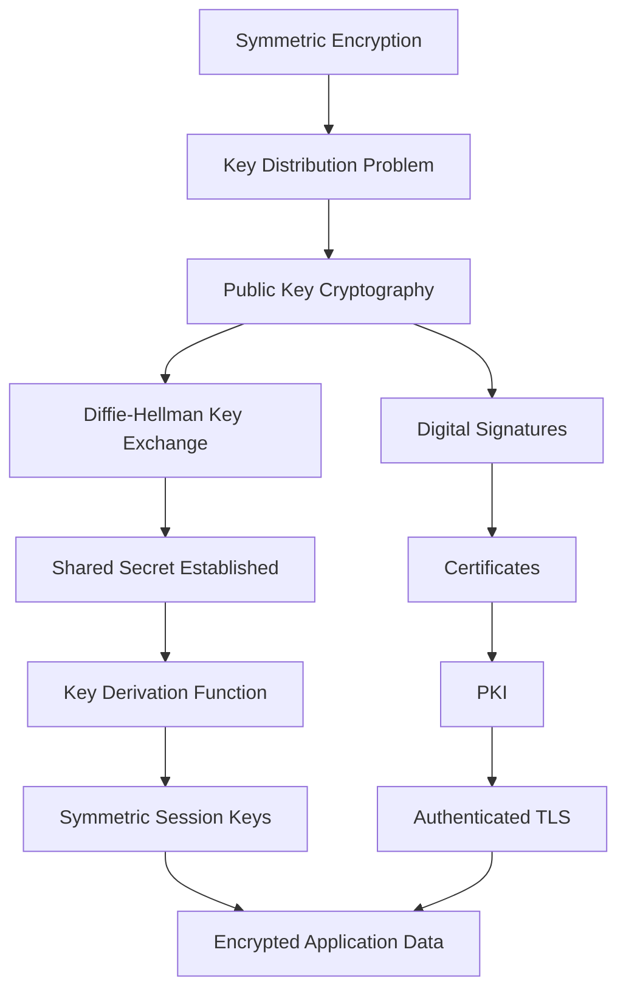
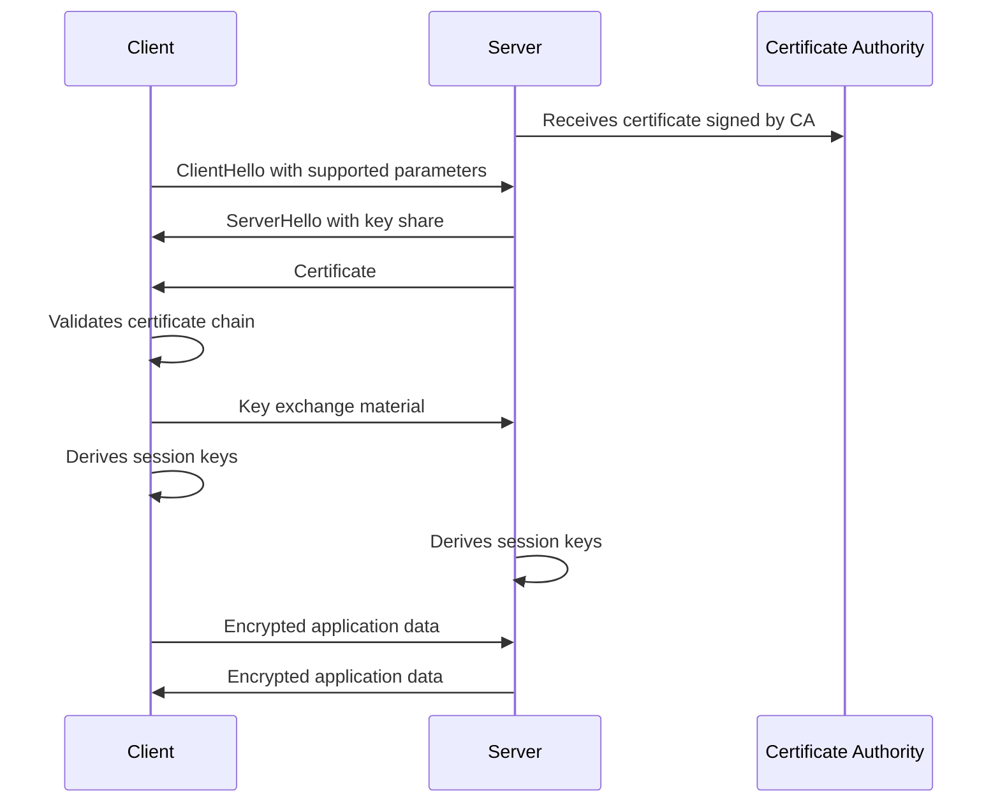

# Diffie-Hellman Key Exchange

## Overview

**Diffie-Hellman key exchange** is one of the foundational breakthroughs in modern cryptography. It allows two parties to establish a shared secret over an insecure communication channel without having previously shared a secret key.

This matters because most secure communication depends on both sides having the same symmetric key. The challenge is getting that key to both parties without exposing it to anyone watching the network.

Diffie-Hellman helped solve that problem.

At a high level, Diffie-Hellman answers this question:

> How can two parties who have never met create the same secret key while an attacker is watching everything they send to each other?

The answer is not that the secret is directly sent across the network. Instead, both parties exchange public values and use their own private values to independently calculate the same shared secret.

That shared secret can then be used to derive symmetric encryption keys.

---

## Why Key Establishment Matters

Before public key cryptography, most encryption depended on **symmetric cryptography**.

In symmetric cryptography, the same secret key is used to encrypt and decrypt data.

```text id="z7box3"
Alice and Bob both know secret key K.

Alice uses K to encrypt.
Bob uses K to decrypt.
```

This works if Alice and Bob already have a secure way to share the key.

But that creates a circular problem:

> To communicate securely, Alice and Bob first need a secure way to exchange the secret key.

That is the **key distribution problem**.

In a small environment, people could exchange keys manually. But at internet scale, that does not work.

Imagine a network with many users. If every pair of users needs a unique shared key, the number of required keys grows extremely quickly.

```text id="clsegl"
Number of pairwise keys = n(n - 1) / 2
```

| Number of Users | Pairwise Shared Keys Needed |
| --------------: | --------------------------: |
|              10 |                          45 |
|             100 |                       4,950 |
|           1,000 |                     499,500 |
|       1,000,000 |          Nearly 500 billion |

This is not manageable for large systems.

Diffie-Hellman changed the problem by making it possible for two parties to derive a shared secret over an insecure channel.

---

## Historical Context

In 1976, **Whitfield Diffie** and **Martin Hellman** published *New Directions in Cryptography*. This paper introduced foundational ideas behind public key cryptography and described a method for establishing shared secrets over insecure channels.

This was a major shift in cryptographic thinking.

Before this period, cryptography generally assumed that parties needed to secretly share keys before secure communication could begin. Diffie-Hellman introduced a new model where public information could be exchanged openly, while private information remained protected.

The breakthrough was not just mathematical. It changed the way secure communication systems could be designed.

Instead of asking:

> How do we securely send the secret key?

Diffie-Hellman allowed systems to ask:

> How can both sides independently compute the same secret without ever sending the secret itself?

That idea became one of the foundations of modern secure communication.

---

## The Core Idea

Diffie-Hellman is a **key agreement protocol**.

That means both parties participate in creating the shared secret.

This is different from directly sending an encrypted key from one party to another.

The basic idea is:

```text id="h5zpgl"
1. Alice chooses a private value.
2. Bob chooses a private value.
3. Alice and Bob exchange public values derived from their private values.
4. Alice combines Bob’s public value with her private value.
5. Bob combines Alice’s public value with his private value.
6. Both arrive at the same shared secret.
```

An attacker watching the exchange sees the public values, but does not know Alice’s or Bob’s private value.

If the parameters are chosen correctly, the attacker cannot efficiently calculate the shared secret from the public information alone.

---

## Simple Analogy: Mixing Paint

A common way to understand Diffie-Hellman is with a paint-mixing analogy.

Assume Alice and Bob want to create the same secret color. An attacker can watch everything they send to each other.

First, Alice and Bob agree on a public starting color.

```text id="uuw7af"
Public color: Yellow
```

Then each person chooses a private color.

```text id="ghsi4d"
Alice's private color: Red
Bob's private color: Blue
```

Alice mixes the public color with her private color.

```text id="2m6fha"
Yellow + Red = Alice's public mixture
```

Bob mixes the public color with his private color.

```text id="ditzc7"
Yellow + Blue = Bob's public mixture
```

They exchange their public mixtures.

Now Alice adds her private color to Bob’s public mixture.

```text id="9y32iw"
Bob's public mixture + Alice's private color
```

Bob adds his private color to Alice’s public mixture.

```text id="2yde96"
Alice's public mixture + Bob's private color
```

Both end up with the same final secret color.

```text id="7u700y"
Yellow + Red + Blue
```

The attacker saw:

```text id="bzwpq1"
Yellow
Yellow + Red
Yellow + Blue
```

But the attacker does not know the private colors.

The real Diffie-Hellman protocol does not use paint. It uses mathematics. But the analogy helps show the main idea:

> Alice and Bob can create the same shared secret without directly sending the secret across the network.

---

## The Simplified Math Behind Diffie-Hellman

Classic Diffie-Hellman is based on modular arithmetic.

Alice and Bob publicly agree on two values:

```text id="ya1heq"
p = a large prime number
g = a generator
```

These values do not need to be secret.

Alice chooses a private number:

```text id="yh774s"
a
```

Bob chooses a private number:

```text id="n6irnp"
b
```

Alice computes her public value:

```text id="k14cpj"
A = g^a mod p
```

Bob computes his public value:

```text id="7lgiwb"
B = g^b mod p
```

Alice sends `A` to Bob.

Bob sends `B` to Alice.

Then Alice computes the shared secret:

```text id="to9hsf"
S = B^a mod p
```

Bob computes the shared secret:

```text id="prbtga"
S = A^b mod p
```

These produce the same result because:

```text id="kupzjx"
B^a mod p = (g^b)^a mod p = g^(ba) mod p

A^b mod p = (g^a)^b mod p = g^(ab) mod p
```

Since:

```text id="eu37dy"
ab = ba
```

Both sides arrive at:

```text id="7cxsjf"
g^(ab) mod p
```

That value becomes the shared secret, or it is used as input to derive cryptographic keys.

---

## What an Attacker Can See

An attacker watching the network can see:

```text id="b1we26"
p
g
A = g^a mod p
B = g^b mod p
```

The attacker does not know:

```text id="khxio5"
a
b
g^(ab) mod p
```

The security of classic Diffie-Hellman depends on the difficulty of solving the **discrete logarithm problem**.

In simple terms:

> It is easy to compute `g^a mod p`, but hard to reverse that operation and recover `a` from `g`, `p`, and `A`.

This is an example of a one-way function: easy in one direction, hard in the reverse direction.

---

## Small Example

A small example can help explain the mechanics.

In real cryptography, the numbers are extremely large. This example uses tiny numbers only for learning.

Assume Alice and Bob agree on:

```text id="1nooaf"
p = 23
g = 5
```

Alice chooses private value:

```text id="3aaezk"
a = 6
```

Bob chooses private value:

```text id="ztc5jg"
b = 15
```

Alice computes:

```text id="a3osfj"
A = 5^6 mod 23
A = 15625 mod 23
A = 8
```

Bob computes:

```text id="z9fz6k"
B = 5^15 mod 23
B = 19
```

Alice sends `A = 8` to Bob.

Bob sends `B = 19` to Alice.

Now Alice computes the shared secret:

```text id="z5wj39"
S = B^a mod 23
S = 19^6 mod 23
S = 2
```

Bob computes the shared secret:

```text id="wynsph"
S = A^b mod 23
S = 8^15 mod 23
S = 2
```

Both Alice and Bob arrive at:

```text id="pqtgk2"
S = 2
```

The attacker saw:

```text id="uc8kph"
p = 23
g = 5
A = 8
B = 19
```

But the attacker did not directly see:

```text id="d5i6fh"
a = 6
b = 15
S = 2
```

Again, these numbers are far too small to be secure. They are only used to show the concept.

---

## Diffie-Hellman Is Not the Same as RSA

It is easy to mix up Diffie-Hellman and RSA because both are part of public key cryptography.

But they are not the same thing.

| Concept                            | Diffie-Hellman               | RSA                                         |
| ---------------------------------- | ---------------------------- | ------------------------------------------- |
| Main purpose                       | Key agreement                | Encryption and digital signatures           |
| Does it directly encrypt messages? | No, not by itself            | It can be used for encryption               |
| Does it create a shared secret?    | Yes                          | Not in the same way                         |
| Does it support signatures?        | Not traditional DH by itself | Yes                                         |
| Common modern use                  | Establishing shared keys     | Signatures, legacy encryption, certificates |
| Security assumption                | Discrete logarithm problem   | Integer factorization problem               |

The simplest distinction is:

```text id="cj8qdl"
Diffie-Hellman helps two parties agree on a shared secret.

RSA can be used to encrypt data or verify digital signatures.
```

Modern TLS generally uses Diffie-Hellman-style key exchange, especially elliptic curve Diffie-Hellman, to establish session keys.

---

## Key Agreement vs Key Transport

There are two important concepts in cryptographic key establishment:

1. **Key agreement**
2. **Key transport**

### Key Agreement

In key agreement, both parties contribute to creating the shared secret.

Diffie-Hellman is a key agreement protocol.

```text id="dps4z4"
Alice contributes private value a.
Bob contributes private value b.

Both derive the same shared secret.
```

Neither side simply sends the final secret to the other.

### Key Transport

In key transport, one party generates or selects a secret and securely sends it to the other party.

Older RSA-based TLS key exchange worked more like key transport.

```text id="4es48t"
Client generates a pre-master secret.
Client encrypts it using the server's RSA public key.
Server decrypts it using the server's RSA private key.
```

This older model had a major drawback: if the server’s private key was later compromised, previously recorded encrypted sessions could potentially be decrypted.

Diffie-Hellman-style key agreement helps avoid this when used with ephemeral keys.

---

## Static Diffie-Hellman vs Ephemeral Diffie-Hellman

There are different forms of Diffie-Hellman.

The most important distinction is between **static** and **ephemeral** Diffie-Hellman.

### Static Diffie-Hellman

In static Diffie-Hellman, a party uses the same long-term private value across multiple sessions.

This can be risky because if that long-term private value is compromised, many sessions may be affected.

### Ephemeral Diffie-Hellman

In ephemeral Diffie-Hellman, fresh temporary private values are generated for each session.

This provides a security property called **forward secrecy**.

Forward secrecy means:

> Even if a long-term private key is compromised later, past session keys should remain protected.

This is extremely important for modern secure communication.

---

## Forward Secrecy

Forward secrecy is one of the most important benefits of ephemeral Diffie-Hellman.

Assume an attacker records encrypted traffic today.

Years later, the attacker somehow steals the server’s long-term private key.

Without forward secrecy, the attacker might be able to decrypt old recorded traffic.

With forward secrecy, old traffic remains protected because each session used temporary key material that was deleted after the session ended.

In simplified form:

```text id="94h0dg"
Session 1 uses temporary DH values.
Session 2 uses different temporary DH values.
Session 3 uses different temporary DH values.

Compromising the server's long-term key later should not reveal the old session secrets.
```

This matters because attackers can perform **harvest now, decrypt later** attacks.

That means they may collect encrypted traffic today and wait for a future opportunity to decrypt it.

Forward secrecy reduces the damage of future key compromise, although it does not fully solve post-quantum risk.

---

## Diffie-Hellman and Man-in-the-Middle Attacks

Unauthenticated Diffie-Hellman has a major weakness.

It does not prove who is on the other side of the exchange.

Suppose Alice wants to communicate with Bob. An attacker named Mallory sits in the middle.

```text id="bmmdot"
Alice ↔ Mallory ↔ Bob
```

Mallory can perform one Diffie-Hellman exchange with Alice and another with Bob.

```text id="qbzx3k"
Alice thinks she has a shared secret with Bob.
Bob thinks he has a shared secret with Alice.

In reality:

Alice shares a secret with Mallory.
Bob shares a different secret with Mallory.
```

Mallory can then decrypt, inspect, modify, and re-encrypt messages between Alice and Bob.

This is the classic **man-in-the-middle attack**.

The issue is not that Diffie-Hellman failed to create a shared secret. It did create shared secrets.

The issue is that Alice and Bob did not authenticate each other.

This is why Diffie-Hellman must be paired with authentication.

---

## How Authentication Fixes the Problem

Diffie-Hellman needs authentication to prevent man-in-the-middle attacks.

In modern systems, authentication is commonly provided through:

* Digital signatures
* Certificates
* Public Key Infrastructure
* Pre-shared keys
* Password-authenticated key exchange
* Secure identity systems

In TLS, the server typically presents an X.509 certificate.

The certificate binds the server’s identity, such as a domain name, to a public key.

The browser verifies:

```text id="oyw0g8"
1. The certificate is valid.
2. The certificate has not expired.
3. The certificate matches the domain.
4. The certificate chains to a trusted root CA.
5. The certificate is allowed for server authentication.
6. The certificate has not been revoked or distrusted.
```

Then the TLS handshake uses authenticated key exchange to establish session keys.

The key point:

> Diffie-Hellman helps establish the shared secret, but certificates and signatures help prove who the shared secret is being established with.

---

## Diffie-Hellman in TLS

TLS uses key exchange to establish shared symmetric keys between a client and server.

A simplified TLS flow looks like this:

```text id="vgwtd2"
1. Client connects to server.
2. Server presents a certificate.
3. Client validates the certificate.
4. Client and server perform key exchange.
5. Both sides derive shared session keys.
6. Application data is encrypted with symmetric encryption.
```

Modern TLS does not use public key cryptography to encrypt all application data.

That would be inefficient.

Instead:

```text id="ahjr97"
Public key cryptography helps authenticate and establish keys.

Symmetric cryptography encrypts the actual traffic.
```

This is why Diffie-Hellman is so important. It helps create the shared session keys that symmetric encryption uses.

---

## Diffie-Hellman in TLS 1.2

TLS 1.2 supported multiple key exchange methods, including older RSA key transport and Diffie-Hellman-based options.

Common TLS 1.2 key exchange types included:

* RSA key transport
* DHE_RSA
* ECDHE_RSA
* ECDHE_ECDSA

The names can be confusing, but they tell you two things:

1. The key exchange method
2. The authentication/signature method

For example:

```text id="uxfjsv"
ECDHE_RSA
```

Means:

```text id="rskibc"
ECDHE = Elliptic Curve Diffie-Hellman Ephemeral for key exchange
RSA = RSA certificate/signature for authentication
```

Another example:

```text id="6vl8v4"
ECDHE_ECDSA
```

Means:

```text id="iddh5h"
ECDHE = Elliptic Curve Diffie-Hellman Ephemeral for key exchange
ECDSA = Elliptic Curve Digital Signature Algorithm for authentication
```

This distinction is important.

Diffie-Hellman handles key agreement.

RSA or ECDSA may handle authentication.

---

## Diffie-Hellman in TLS 1.3

TLS 1.3 simplified and modernized the handshake.

In TLS 1.3, ephemeral Diffie-Hellman-style key exchange is the normal model.

TLS 1.3 removed several older and weaker options, including static RSA key transport.

This improved the security posture of TLS by making forward secrecy standard.

A simplified TLS 1.3 handshake includes:

```text id="kellvf"
1. ClientHello
   - Client sends supported cipher suites.
   - Client sends key share.

2. ServerHello
   - Server selects parameters.
   - Server sends its key share.

3. Server Authentication
   - Server sends certificate.
   - Server signs handshake data.

4. Key Derivation
   - Client and server derive shared secrets.

5. Encrypted Application Data
   - Traffic is protected with symmetric encryption.
```

TLS 1.3 is designed so that most of the handshake after the initial exchange is encrypted.

The core idea remains:

> Use authenticated key exchange to derive shared symmetric keys.

---

## Classic DH vs ECDH

Classic Diffie-Hellman uses modular arithmetic over finite fields.

Modern systems often use **Elliptic Curve Diffie-Hellman (ECDH)** or **Elliptic Curve Diffie-Hellman Ephemeral (ECDHE)**.

### Classic Diffie-Hellman

Classic DH is based on the discrete logarithm problem in finite fields.

It uses values like:

```text id="y1c3cb"
p = large prime
g = generator
```

Security depends on making the numbers large enough.

### Elliptic Curve Diffie-Hellman

ECDH uses elliptic curve mathematics.

It can provide strong security with smaller key sizes compared to classic finite-field DH.

This makes ECDH efficient for modern systems.

### ECDHE

ECDHE means **Elliptic Curve Diffie-Hellman Ephemeral**.

This means fresh temporary elliptic curve key material is generated for each session.

ECDHE is widely used in modern TLS because it supports forward secrecy and performs efficiently.

---

## Why Symmetric Encryption Is Still Used

Public key cryptography is powerful, but it is generally slower than symmetric cryptography.

That is why protocols like TLS use a hybrid approach.

```text id="ts25qs"
Asymmetric cryptography:
- Authentication
- Key exchange
- Digital signatures

Symmetric cryptography:
- Bulk data encryption
- Fast protection of application traffic
```

After Diffie-Hellman establishes a shared secret, both sides use a key derivation function to generate symmetric keys.

Those keys are then used with algorithms such as AES-GCM or ChaCha20-Poly1305.

So Diffie-Hellman is not usually protecting every byte of data directly.

It helps create the keys that protect the data.

---

## Key Derivation

The raw Diffie-Hellman shared secret is usually not used directly as an encryption key.

Instead, it is passed into a **key derivation function (KDF)**.

The KDF turns the shared secret into cryptographically strong keys for specific purposes.

For example, TLS derives separate keys for:

* Client-to-server encryption
* Server-to-client encryption
* Integrity protection
* Handshake protection
* Application data protection

A simplified flow:

```text id="q17m0c"
Diffie-Hellman shared secret
        ↓
Key Derivation Function
        ↓
Session keys
        ↓
Symmetric encryption
```

This is important because secure protocols need more than just one raw secret. They need carefully derived keys with separation between different purposes.

---

## Diffie-Hellman and Certificates

Diffie-Hellman by itself does not require certificates.

However, TLS commonly combines Diffie-Hellman with certificates.

The certificate does not usually contain the Diffie-Hellman shared secret.

Instead, the certificate helps authenticate the server.

In a simplified TLS model:

```text id="iemoun"
Certificate:
Proves the server's identity.

Diffie-Hellman:
Establishes shared session keys.

Symmetric encryption:
Protects the actual data.
```

This distinction matters because certificates and key exchange solve different parts of the secure communication problem.

| Component             | Purpose                        |
| --------------------- | ------------------------------ |
| Certificate           | Binds identity to a public key |
| Certificate Authority | Vouches for the certificate    |
| Diffie-Hellman        | Establishes a shared secret    |
| Digital Signature     | Authenticates handshake data   |
| Symmetric Encryption  | Encrypts application traffic   |

---

## Common Misunderstandings

### Misunderstanding 1: Diffie-Hellman Encrypts the Message

Diffie-Hellman does not directly encrypt application messages.

It establishes a shared secret.

That shared secret is used to derive symmetric keys, and those symmetric keys encrypt the actual data.

### Misunderstanding 2: The Public Key Decrypts the Message

In public key encryption systems, the public key may be used to encrypt and the private key may be used to decrypt.

But in digital signatures, the private key signs and the public key verifies.

For Diffie-Hellman, the better framing is:

```text id="w2m7as"
Private value + other party's public value = shared secret
```

### Misunderstanding 3: Diffie-Hellman Solves Identity

Diffie-Hellman solves key agreement.

It does not solve identity by itself.

Without authentication, Diffie-Hellman is vulnerable to man-in-the-middle attacks.

### Misunderstanding 4: TLS Uses Public Key Cryptography for Everything

TLS uses public key cryptography during the handshake.

The actual application data is protected with symmetric encryption.

### Misunderstanding 5: Forward Secrecy Means Future-Proof

Forward secrecy protects past sessions from later compromise of long-term private keys.

It does not automatically make systems safe against all future cryptographic threats, including quantum attacks against recorded handshakes that used quantum-vulnerable algorithms.

---

## Diffie-Hellman and Post-Quantum Cryptography

Diffie-Hellman is secure today against classical computers when implemented correctly with strong parameters.

However, a cryptographically relevant quantum computer would threaten classic Diffie-Hellman and elliptic curve Diffie-Hellman.

This is because Shor’s algorithm could theoretically solve the mathematical problems that DH and ECDH rely on:

* The discrete logarithm problem
* The elliptic curve discrete logarithm problem

This matters for post-quantum cryptography because many modern secure communication protocols rely on DH or ECDH for key establishment.

### Harvest Now, Decrypt Later

An attacker may collect encrypted traffic today and store it.

Later, if quantum computers become capable of breaking the key exchange, the attacker may try to recover old session secrets.

This is known as:

```text id="lzq5ga"
Harvest now, decrypt later
```

Forward secrecy helps protect against later compromise of long-term keys, but it does not fully protect against a future quantum computer that can break the key exchange itself.

This is why post-quantum key establishment is important.

---

## Future Direction: Post-Quantum Key Establishment

Post-quantum cryptography aims to replace or supplement algorithms that are vulnerable to quantum attacks.

For key establishment, one of the major post-quantum approaches is based on **Key Encapsulation Mechanisms (KEMs)**.

A KEM is different from traditional Diffie-Hellman, but it serves a related purpose: establishing shared secret key material between parties.

A simplified KEM flow:

```text id="to9vp9"
1. Receiver has a public key and private key.
2. Sender uses the receiver's public key to encapsulate a shared secret.
3. Sender sends a ciphertext to the receiver.
4. Receiver uses the private key to decapsulate the ciphertext.
5. Both sides arrive at the same shared secret.
```

In post-quantum TLS migration, systems may use hybrid approaches that combine classical key exchange with post-quantum key establishment.

For example:

```text id="bd7tk7"
ECDHE + post-quantum KEM
```

The goal is to remain secure even if one algorithm family becomes vulnerable.

---

## Why Diffie-Hellman Still Matters

Diffie-Hellman is still worth studying because it explains the foundation of modern secure communication.

Even when future systems migrate to post-quantum algorithms, the core problem remains similar:

> How do two parties establish shared secret key material over an untrusted network?

Diffie-Hellman teaches the historical and conceptual answer to that question.

It also helps explain why TLS, certificates, PKI, and post-quantum cryptography are connected.

The chain of ideas looks like this:

```text id="tf1rm6"
Symmetric encryption requires shared keys.
Shared keys are hard to distribute.
Diffie-Hellman enables key agreement over insecure channels.
Unauthenticated key agreement is vulnerable to man-in-the-middle attacks.
Certificates and PKI help authenticate parties.
TLS combines authentication, key exchange, and symmetric encryption.
Post-quantum cryptography is now changing the key establishment layer.
```

---

## Visual Summary



---

## Simplified TLS View



---

## Key Terms

| Term                       | Meaning                                                                      |
| -------------------------- | ---------------------------------------------------------------------------- |
| Symmetric encryption       | Encryption where the same secret key is used to encrypt and decrypt          |
| Key distribution problem   | The challenge of securely sharing secret keys before communication           |
| Public key cryptography    | Cryptography using public/private key pairs                                  |
| Diffie-Hellman             | A key agreement protocol for establishing a shared secret                    |
| Shared secret              | Secret value derived by both parties and used to create encryption keys      |
| Discrete logarithm problem | Mathematical problem that classic DH security relies on                      |
| ECDH                       | Elliptic Curve Diffie-Hellman                                                |
| ECDHE                      | Ephemeral Elliptic Curve Diffie-Hellman                                      |
| Forward secrecy            | Protection of past sessions even if long-term keys are later compromised     |
| Man-in-the-middle attack   | Attack where an adversary secretly intercepts and relays communication       |
| Certificate                | Data structure binding an identity to a public key                           |
| Certificate Authority      | Trusted entity that signs certificates                                       |
| TLS                        | Protocol that secures communication over networks                            |
| KDF                        | Key derivation function used to derive usable keys from shared secrets       |
| KEM                        | Key encapsulation mechanism, commonly used in post-quantum key establishment |

---

## Final Takeaway

Diffie-Hellman is one of the most important ideas in cryptography because it changed how secure communication could begin.

Before Diffie-Hellman, secure communication generally required two parties to already share a secret.

Diffie-Hellman made it possible for two parties to establish a shared secret over an insecure network.

However, Diffie-Hellman alone does not prove identity. That is why modern systems combine key exchange with authentication, certificates, digital signatures, and PKI.

The cleanest way to remember it is:

```text id="i39r7l"
Diffie-Hellman solves the shared secret problem.

Certificates solve the identity problem.

TLS combines both to secure internet communication.
```

This is why Diffie-Hellman remains foundational to understanding TLS, PKI, and the transition toward post-quantum cryptography.

